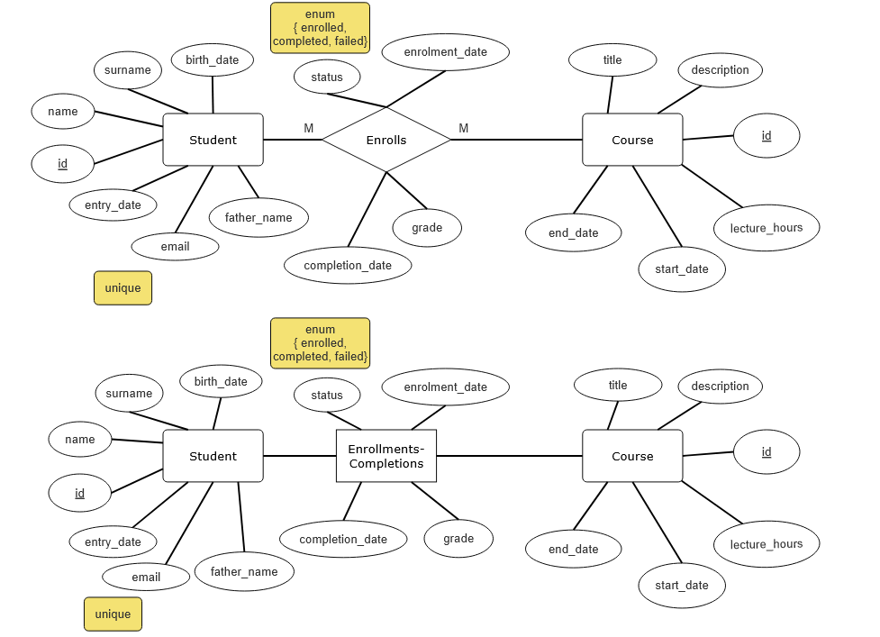

# Laravel E-Learning Management System RESTful API with Sail + PostgreSQL

This project is a simple Laravel e-learning management system REST API using [Laravel Sail](https://laravel.com/docs/sail), the official Laravel Docker development environment. It includes PostgreSQL, and is ready to get up and running with minimal setup.

## Database schema

There are 3 entities inside the database:

1. Students
2. Courses
3. Enrolments/Completions

## 🛠 Requirements

- [Docker Desktop](https://www.docker.com/products/docker-desktop) installed and running
- Git
- Optional: [Composer](https://getcomposer.org/) 

## 🚀 Getting Started

### 1. Clone the Repository

```bash
git clone https://github.com/Shiryous/e-learning-management-system.git
cd e-learning-management-system
```

### 2. Copy the `.env` file

```bash
cp .env.example .env
```

### 3. Start Laravel Sail (Docker)

Install PHP and Sail if not installed yet (optional):
```bash
sudo apt update && sudo apt install php-cli unzip curl git php-mbstring php-xml php-bcmath php-curl -y
```
```bash
docker run --rm \
-u "$(id -u):$(id -g)" \
-v "$(pwd):/var/www/html" \
-w /var/www/html \
laravelsail/php84-composer:latest \
composer install --ignore-platform-reqs

```
Make an alias to simplify commands
```bash
echo "alias sail='[ -f sail ] && sh sail || sh vendor/bin/sail'" >> ~/.bashrc
source ~/.bashrc
```
Start the app:

```bash
sail up -d
```

If you get a permission error, try:

```bash
chmod +x vendor/bin/sail
```

### 4. Generate App Key

```bash
sail artisan key:generate
```

### 5. Configure the Database

Open `.env` and make sure your DB settings match Sail’s defaults:

```env
DB_CONNECTION=pgsql
DB_HOST=pgsql
DB_PORT=5432
DB_DATABASE=laravel
DB_USERNAME=sail
DB_PASSWORD=password
```

### 6. Run Migrations
```bash
sail artisan migrate:install
```
```bash
sail artisan migrate
```

### 7. Seed Database
```bash
sail artisan db:seed
```
## Testing the API

You can test the endpoints with [Postman](https://www.postman.com/).

Example base URL:

```
http://localhost/api/...
```


## Useful Sail Commands

```bash
sail artisan migrate          # Run DB migrations
sail artisan db:seed          # Seed the database
sail artisan test             # Run tests
sail down                     # Stop the containers
```

## 📄 License

This project is open-sourced under the [MIT license](LICENSE).
